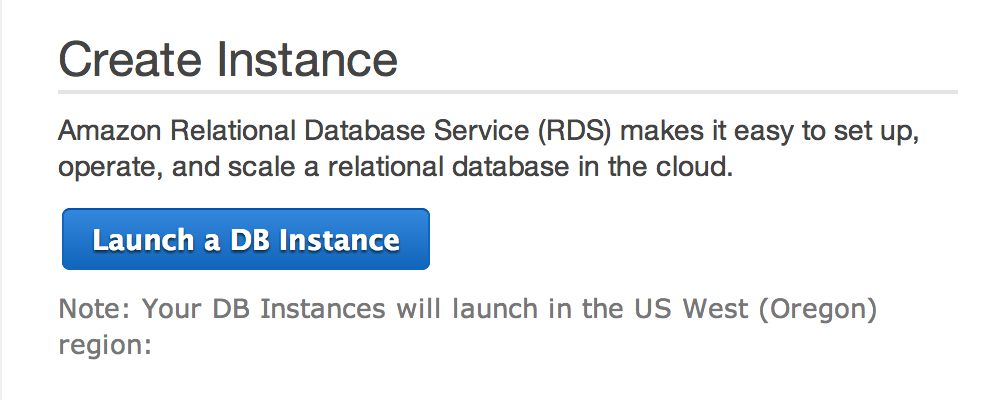

# Creating an Amazon AWS RDS MySQL Database

1. Sign in to your [Amazon AWS](http://aws.amazon.com/) account.
2. From the *Console Home*, click on the `RDS` icon.


3. Click on `Launch a DB Instance`.


4. Select `MySQL Community Edition`.


5. Select `No` regarding the production question and click `Next`.


6. Specify the DB details. **Be sure to select a `db.t1.micro` instance and select `No` for the Multi-AZ Deployment
option.** You can allocate up to *30GB* of storage. Fill in an identifier, username, and password, then click `Next`.


7. Add a `Database Name` in the Configure Advanced Settings step. Then click `Launch DB Instance`.


8. Click on `View your DB instances on the DB Instances page`.


9. After several minutes, your RDS database should be created. You should now have an RDS Endpoint.


To connect to your RDS database, open the terminal and type:

    ```
    mysql -h myinstance.123456789012.us-east-1.rds.amazonaws.com -P 3306 -u mymasteruser -p
    ```

10. Congratulations! You have launched your RDS database.
